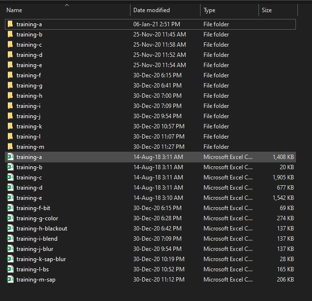
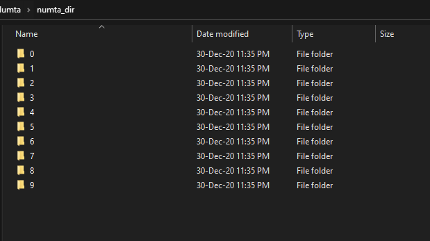
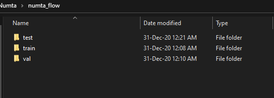
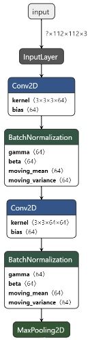
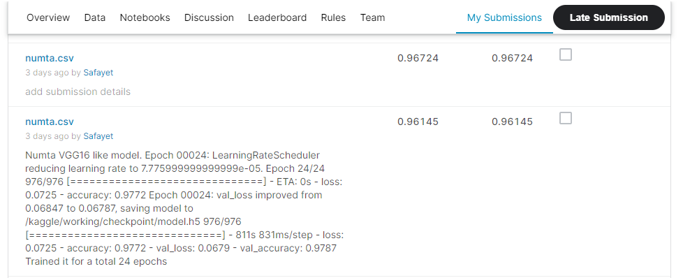

# Bengali-Handwritten-Digit-Classifier
This repository contains my solution of [NumtaDB: Bengali Handwritten Digits](https://www.kaggle.com/c/numta), a Kaggle contested, hosted by [Bengali.Ai](https://bengali.ai/). The CNN architecture used in this repository is similar to the [VGG16](https://arxiv.org/pdf/1409.1556.pdf) but the model used in this repository has BatchNormalization layers for regularization purposes.

### Install
This project requires **Python** and the following Python libraries installed:
- [NumPy](https://www.numpy.org/)
- [Pandas](https://pandas.pydata.org/)
- [matplotlib](https://matplotlib.org/)
- [TensorFlow](https://www.tensorflow.org/)
- [OpenCV](https://opencv.org/)
- [scikit-learn](https://scikit-learn.org/stable/)
- [shutil](https://docs.python.org/3/library/shutil.html)
- [split-folders](https://pypi.org/project/split-folders)
- [glob](https://docs.python.org/3/library/glob.html)
- [os](https://docs.python.org/3/library/os.html)
- [csv](https://docs.python.org/3/library/csv.html)
- [Pillow](https://pypi.org/project/Pillow/2.2.1)

If you do not have Python installed yet, it is highly recommended that you install the [Anaconda](https://www.anaconda.com/) distribution of Python, which already has most of the above packages. 

### Short Description of Each File
1. **bit_and_f.py**- return random images with its black color turn into white and white color turn into black. (used for data augmentation)
2. **color_change.py**- select a sample image and return two graphs. The first graph is used for visualizing the color change of the sample image and another graph for visualizing the HSV value of the sample image in a 3D plot. This script is helpful for selecting the constant value in **color_g.py** scripts.
3. **color_g.py**- return random images with random colors. (used for data augmentation)
4. **black_out_h.py**- return random images with part of the images are blacked out. (used for data augmentation)
5. **blend_i.py**- return random images with the blending of two images. one image shaded in the background(some background images are rotated at a 90-degree angle) and another one, the main image in the front. (used for data augmentation)
6. **blur_j.py**- return random images with random blurriness. (used for data augmentation)
7. **sap_blur_k.py**- randomly select images from the blur image directory and return random images with salt-and-pepper noise added to them. (used for data augmentation)
8. **brightness_sharpness_l.py**- return random images with random brightness and sharpness. (used for data augmentation)
9. **sap_m.py**- return random images with salt-and-pepper noise added to them. (used for data augmentation)

**sap_m.py** is the last script for data augmentation. After running this script, my data directory looks like this:  

10. **flow_from_dir.py**- The [ImageDataGenerator](https://www.tensorflow.org/api_docs/python/tf/keras/preprocessing/image/ImageDataGenerator) class has three methods flow(), flow_from_directory() and flow_from_dataframe() to read the images from a big NumPy array or folders containing images. I cannot train my model with the flow() method on my dataset because my memory becomes exhausted. For this reason, the flow_from_directory() method is helpful for me. flow_from_directory() method takes chunks of data and stored in memory and then trained and discarded for fresh chunks of data. It works like a *circular buffer*. This script is useful to make the data in flow_from_directory() method format. 

After running the **flow_from_dir.py** script, my data directory looks like this:  

11. **random_split.py**- According to [François Chollet](https://fchollet.com/), creator and project lead of [Keras- Deep learning library](https://keras.io/),

>"Correct. The validation data is picked as the last 10% (for instance, if validation_split=0.9) of the input. The training data (the remainder) can optionally be shuffled at every epoch (shuffle argument in fit). That doesn't affect the validation data, obviously, it has to be the same set from epoch to epoch." [GitHub Post Link](https://github.com/keras-team/keras/issues/597).  

So, that's why I use [split-folders](https://pypi.org/project/split-folders) to randomly shuffle my data while making train set and validation set. Note that, I copy-pasted [NumtaDB](https://www.kaggle.com/c/numta) test folders in my data directory. 

After running the **random_split.py** script, my data directory looks like this:  

12. **numta_vgg_model.py**- This script contains a convolutional neural network(CNN) architecture that is similar to the [VGG16](https://arxiv.org/pdf/1409.1556.pdf) but the model used in this script has BatchNormalization layers for regularization purpose. This model is run for 50 epochs and the best model was used for final submission. 

Graphical visualization of initial part of the model: [(Link of graphical visualization of the full model)](https://github.com/Safayet-Khan/Bengali-Handwritten-Digit-Classifier/blob/main/images/full_model.png)  

### Kaggle Data and Kernel
- [Kaggle Data](https://www.kaggle.com/safayet42/numtaflow)- [NumtaDB: Bengali Handwritten Digits](https://www.kaggle.com/c/numta), a Kaggle contested, hosted by [Bengali.Ai](https://bengali.ai/). [Numta Handwritten Bengali Digits](https://bengali.ai/datasets/) data copyright and license belong to [Bengali.Ai](https://bengali.ai/). I augmented this [Numta Handwritten Bengali Digits](https://bengali.ai/datasets/) data and restructured it, for my own convenience.  
- [Kaggle Kernel](https://www.kaggle.com/safayet42/numta-vgg-model)- This notebook contains my code for this competition (This code is the same as **numta_vgg_model.py**). One can use this kernel to re-generate the results. Note that: Kaggle provides 9 hours per each session. So one will not be able to run this model for 50 epochs in the Kaggle kernel. To my best estimations, 30-35 epochs could be run in the Kaggle kernel.  

### Result
My best submission result was **0.96724 on both Private Score and Public Score**. This Kaggle contest was over almost two years ago, so I did not get my score to Leaderboard.    
  
  
Note that the *winner* of this Kaggle contest was [Team: Backpropers, Score: 0.99359](https://www.kaggle.com/c/numta/leaderboard).

### Reference
- [NumtaDB: Bengali Handwritten Digits](https://www.kaggle.com/c/numta)
- [Bengali.Ai](https://bengali.ai/)
- [VERY DEEP CONVOLUTIONAL NETWORKS FOR LARGE-SCALE IMAGE RECOGNITION](https://arxiv.org/pdf/1409.1556.pdf)
- [Simple Keras Starter](https://www.kaggle.com/reasat/simple-keras-starter)
- [Keras - Train from folder - Augmentation compare](https://www.kaggle.com/misirali/keras-train-from-folder-augmentation-compare)
- [stratified sampling](https://stackoverflow.com/questions/53074712/how-to-split-folder-of-images-into-test-training-validation-sets-with-stratified)

